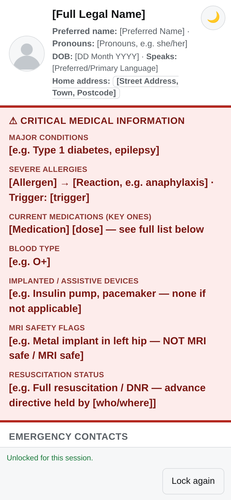

# ice v1.0

A single-page, self-hosted "In Case of Emergency" (ICE) medical info page,
meant to be linked from a QR code on a wristband, phone case, or wallet
card. Critical medical information (conditions, allergies, medications,
blood type, DNR status, etc.) is shown immediately to anyone who opens the
link — no login, no app, nothing to install — while your home address,
phone numbers, and NHS/policy number stay hidden behind a private unlock
word until someone who needs them types it in.

*(Shown with the example placeholder data — see [Setup](#setup) below.)*

## Why

The idea behind ICE (In Case of Emergency) contacts is old — it's normally
just a contact named "ICE" in your phone.This does the same job but as a
page a first responder can actually read without unlocking your phone:
conditions, allergies, medications, and care team all in one place,
reachable by scanning a QR code or going to a URL. With contact and sensitive
information locked behind a simple word that is unique.

## Features

- **Critical info shown openly** — conditions, allergies, medications,
  blood type, implants, MRI flags, and resuscitation status are visible
  immediately, with no gate at all.
- **Sensitive fields stay locked** — home address, phone numbers, and
  NHS/policy number are masked until the correct unlock word is entered.
  The check happens server-side in PHP; the real values are never sent to
  the browser while the page is locked (view source or the network tab
  reveals nothing extra).
- **QR code generator** — a button on the page generates a QR code for the
  page's own URL, entirely client-side (no third-party service sees the
  URL).
- **Printable wallet card** — generates a real credit-card-sized
  (85.6 × 53.98mm) printable card with the page's URL, a QR code, and an
  optional spot to write in the unlock word by hand or type it in before
  printing.
- **Light/dark theme**, mobile-first layout, and `noindex`/`X-Robots-Tag`
  headers so the page doesn't turn up in search engines.
- No database, no build step, no dependencies beyond PHP — it's one
  `index.php` file plus a small vendored QR library.

## Setup

1. Copy this repo to any PHP-enabled web server (PHP 7.4+, no extensions
   or database required — just `session` support, which is built in).

2. Copy each `*.example.php` file to the same name without `.example`, and
   fill in real values:

   | Copy this... | ...to this | Contains |
   |---|---|---|
   | `config.example.php` | `config.php` | The unlock word, and the site's URL |
   | `profile-data.example.php` | `profile-data.php` | Everything shown openly (name, conditions, medications, care team, history) |
   | `sensitive-data.example.php` | `sensitive-data.php` | Address, phone numbers, NHS/policy number — gated behind the unlock word |
   | `photo.example.png` | `photo.png` | A photo shown in the header (optional — a fallback with your initials shows if it's missing) |

   These four files are all gitignored, so your real data is never
   committed. `index.php` itself never needs editing — it's just the
   template — so a future update to it won't overwrite your content.

3. Deploy over **HTTPS**. The unlock word is a privacy screen against a
   casual glance, not a security boundary — see the security note below —
   and HTTPS keeps it from being visible in transit.

4. Visit the page, confirm the layout and unlock word work, then use the
   **QR code generator** button to get a scannable code for the page, or
   the **Print card** button to print a wallet-sized card with the URL
   and QR code on it. Put the QR code (or the printed card) on a
   wristband, phone case, or in a wallet.

## Security notes

- The unlock word has **no rate limiting**. It's meant to stop a stranger
  who finds your wristband from casually reading your address off their
  phone, not to resist someone deliberately trying to guess it. Don't
  reuse a password you care about, and don't treat this as a substitute
  for real access control.
- Printing the unlock word onto the wallet card (optional, opt-in) means
  anyone holding that physical card — or a saved PDF of it — can unlock
  your full details. It's off by default for this reason.
- `config.php`, `profile-data.php`, `sensitive-data.php`, and `photo.png`
  are all gitignored. Double-check `git status` before committing if
  you've renamed or restructured anything, so real personal data never
  ends up in the repo.

## Credits

QR code generation uses [`qrcode-generator`](https://github.com/kazuhikoarase/qrcode-generator)
by Kazuhiko Arase (MIT licensed), vendored in `qrcode.lib.js` so it runs
entirely client-side with no external requests.

## License

GPL-3.0. See [LICENSE](LICENSE).
